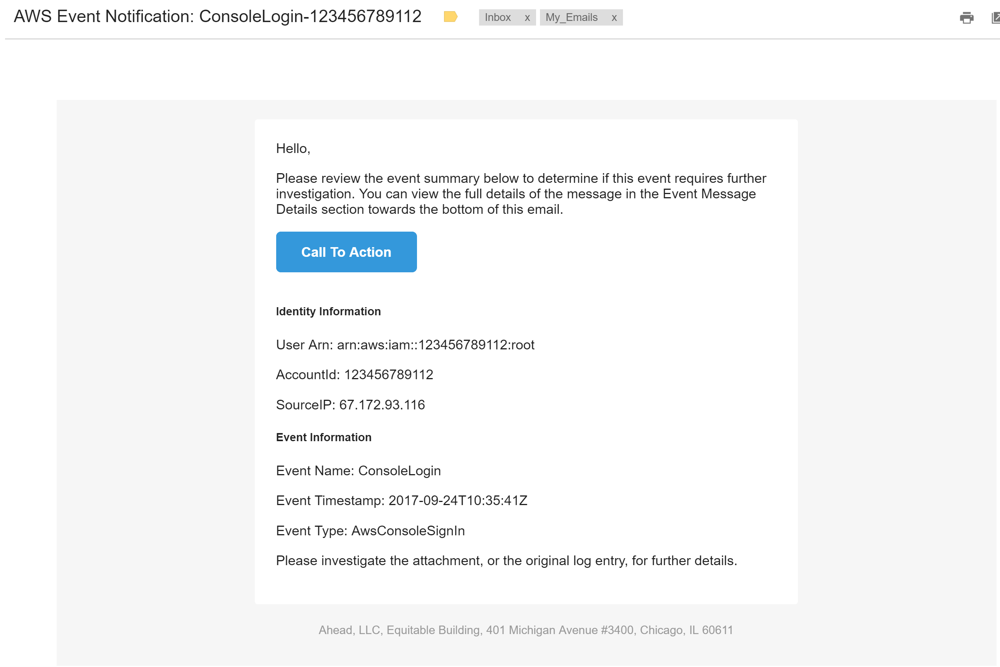

## AWS Event Manager 

This function transforms JSON Events from CloudWatch Events, CloudWatch Logs Metric Filters, and other (future) events into friendly HTML emails for end users:

* Pulls identity information and event information and displays in an easy to read format
* Transforms full JSON event into HTML table for simpler navigation (when reading the full event details)
* Python 2.7/Boto3

To use this function, all that is required is to update the aws-em.py file with the distribution address where emails should be delivered. As a feature request, a confirm file may be created for customization--these details may also be handled at deploy time (terraform/cloudformation).  

A diagram of the architecture of this system can be seen below:

(Serverless Message Transformation and Delivery - Page 1.png "AWS EM Serverless Mailer")

## Email Message

Right now, the email message uses a simple free template, which we import in Python, and template using the jinja2 template library. At the moment, this is simply
a simple black and white template that displays the template properties for the user. This template will likely change, and we aren't set in stone on the colors or columns, etc.

## Support for Various Events

**Important** This function supports thousands of events, due to the fact that most events use a few event message structures (meaning the structure of the JSON object that is sent when an event occurs). However, it is outside of our control to enforce consistency on AWS Services, and so if event messages deviate from that standard, and if the function has not been updated to account for that structure, the full message details are transformed into an HTML table, instead of the select properties.

